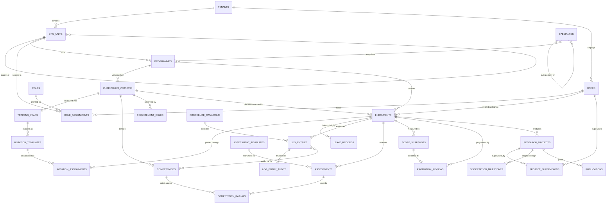
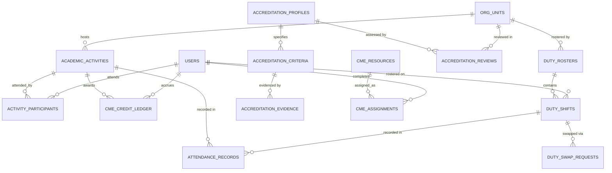

# Data model

62 tables in ten bounded contexts. Every table carries `id` (32-char UUID hex),
`created_at` and `updated_at`; most carry `tenant_id`.

Full column detail lives in the model modules, which are commented — this document is
the map and the reasoning.

---

## Contexts

| Context | Module | Tables |
|---|---|---|
| Tenancy | `models/tenancy.py` | `tenants`, `org_units`, `tenant_integrations` |
| Identity | `models/identity.py` | `users`, `roles`, `permissions`, `role_assignments`, `supervisor_profiles`, `user_sessions` |
| Curriculum | `models/curriculum.py` | `specialties`, `programmes`, `curriculum_versions`, `training_years`, `rotation_templates`, `competencies`, `requirement_rules`, `procedure_catalogue` |
| Training | `models/training.py` | `enrolments`, `rotation_assignments`, `leave_records`, `transfer_records` |
| Duty | `models/duty.py` | `duty_rosters`, `duty_shifts`, `duty_swap_requests`, `attendance_records` |
| Logbook | `models/logbook.py` | `log_entries`, `log_entry_audits`, `log_entry_competencies`, `teaching_records` |
| Assessment | `models/assessment.py` | `assessment_templates`, `assessments`, `competency_ratings`, `msf_rounds` |
| Academic | `models/academic.py` | `academic_activities`, `activity_participants`, `conference_records` |
| CBT | `models/cbt.py` | `question_banks`, `questions`, `exam_papers`, `exam_attempts`, `exam_responses` |
| CME | `models/cme.py` | `cme_resources`, `cme_assignments`, `cme_credit_ledger` |
| Research | `models/research.py` | `research_projects`, `project_supervisions`, `dissertation_milestones`, `supervision_meetings`, `publications` |
| Analytics | `models/analytics.py` | `score_snapshots`, `promotion_reviews`, `accreditation_profiles`, `accreditation_criteria`, `accreditation_reviews`, `accreditation_evidence` |
| System | `models/system.py` | `notification_templates`, `notification_rules`, `notifications`, `audit_logs`, `sync_checkpoints`, `sync_conflicts`, `generated_reports` |

---

## Core relationships



## Academic, duty and accreditation



---

## Design notes worth knowing

### One tree, not eight tables

`org_units` is self-referential with a `kind` discriminator. `path` is a materialised
ancestor path; `depth` is its length. A subtree query is:

```sql
SELECT * FROM org_units
WHERE tenant_id = :tenant AND path LIKE :prefix || '/%'
```

One index, identical semantics on SQLite and PostgreSQL. The alternative — a table per
level — forces every institution into the full eight-level ladder and makes
"everything under Surgery" an eight-way union.

### Enrolments pin a curriculum version

`enrolments.curriculum_version_id` is `ON DELETE RESTRICT`. Publishing a new
curriculum supersedes the old one for *new* enrolments only. A trainee is always
measured against the rules that were in force when they started — which is what a
college expects, and what fairness requires.

### Logbook entries hold no patient identity

`patient_reference` is a pseudonymous, institution-local token. Age, sex, diagnosis
and procedure are recorded; name, hospital number and date of birth are not. The
platform is deliberately outside the scope of patient-record regulation.

### Everything syncable carries a revision

`SyncMixin` adds `revision`, `client_uuid` and `synced_at`. `revision` increments via
a SQLAlchemy `before_update` event, so it cannot be forgotten at a call site.
`client_uuid` is what makes an offline replay idempotent.

### Score snapshots are wide on purpose

`score_snapshots` stores each domain as its own column *and* keeps
`requirement_results`, `metrics` and `weights_used` as JSON. The columns make trend
queries fast; the JSON means a score computed in 2026 can still be explained in 2029
after the curriculum has changed twice.

### Competency ratings are append-only

Never updated. Current attainment is the latest rating per competency; earlier
ratings are the progression history a supervisor discusses at review.

### Audit is separate from the domain

`log_entry_audits` covers the logbook specifically — logbooks are evidentiary
documents for college examinations, and the platform must be able to prove who
changed what. `audit_logs` covers everything else, with secret redaction on write.

---

## Indexing

Beyond primary and foreign keys:

| Table | Index | Serves |
|---|---|---|
| `org_units` | `(tenant_id, path)` | Subtree resolution on every permission check |
| `log_entries` | `(enrolment_id, occurred_at)` | Logbook listing and window measurement |
| `log_entries` | `(supervisor_id, validation_status)` | The validation queue |
| `log_entries` | `(tenant_id, validation_status)` | Department validation-rate metrics |
| `enrolments` | `(tenant_id, status)`, `(programme_id, current_year)` | Cohort dashboards |
| `enrolments` | `latest_rag` | At-risk filtering without recomputation |
| `rotation_assignments` | `(enrolment_id, start_date, end_date)` | "Which rotation was this on?" |
| `competency_ratings` | `(enrolment_id, competency_id, rated_on)` | Latest-rating-per-competency |
| `academic_activities` | `(org_unit_id, scheduled_at)` | Calendar and attendance denominators |
| `score_snapshots` | `(enrolment_id, computed_at)` | Trend charts |
| `audit_logs` | `(tenant_id, created_at)`, `(entity_type, entity_id)` | Audit search |

### Denormalisation, deliberately

`enrolments.latest_overall_score`, `latest_rag` and `promotion_ready` are copies of
the newest snapshot. A 300-trainee cohort list would otherwise need 300 score
computations. They are refreshed by `scoring.persist_snapshot()` and are never a
source of truth — every detail view recomputes.

---

## Migrations

```bash
make migration m="add teaching feedback score"   # autogenerate
make migrate                                     # apply
make migration-check                             # fail if models drifted
```

`alembic/env.py` takes the URL from application settings, so a migration can never run
against a different database than the app. It also registers a `render_item` hook for
the custom `UtcDateTime` type — without it, autogenerate emits an unqualified
reference and the migration fails at import.

CI runs `alembic upgrade head`, `downgrade base`, `upgrade head` again, then
`alembic check`. A model change without a migration fails the build.
